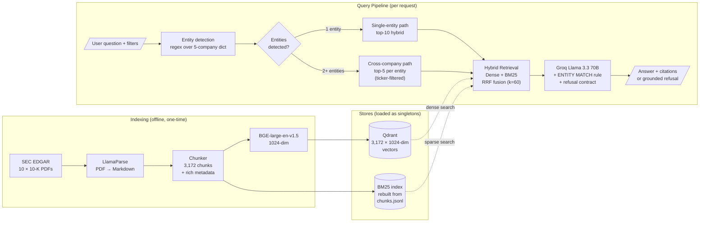

<!--
TODO Day 14 - replace placeholders before launch:
  1. Search for DEMO_LINK and replace "_coming on launch_" with the HF Spaces URL
  2. Search for VIDEO_LINK and replace "_coming on launch_" with the Loom/YouTube URL
-->

# Financial RAG

Question-answering over SEC 10-K filings for Apple, Microsoft, NVIDIA, Tesla, and Meta — with hybrid retrieval, query decomposition for cross-company comparisons, and grounded answers with citations.


## TL;DR

- **28/28 questions** answered or correctly refused on a hand-curated 7-category eval set.
- **Hybrid retrieval (Dense + BM25 + RRF)** beats dense-only on Hit@10 (**1.00 vs 0.96**). Reranker measured to *hurt* MRR on this corpus — default off, against the textbook "always rerank" advice.
- **Cross-company answer rate: 50% → 100%** after adding query decomposition. Ablation table below.
- **Hallucination defense via an ENTITY MATCH rule** in the system prompt — caught a *Google-revenue-from-Meta-chunk* attribution error during spot-check that would have shipped silently otherwise.
- Built in 14 days on an 8GB-RAM Windows laptop with **no GPU**, **$0 spend** (open-weight models + free tiers).

**[▶ Try the live demo](https://huggingface.co/spaces/25Sad/financial-rag)** <!-- DEMO_LINK -->
**Demo video:** _coming soon_ <!-- VIDEO_LINK -->

## The problem

SEC 10-K filings are public, well-structured, and high-stakes. They're also dense (~200 pages each), mix prose with tables, and use unfamiliar accounting terminology.

Useful retrieval over them has to handle four things at once:

1. **Ambiguous vocabulary** — "data center revenue" leans NVDA; "cloud revenue" leans MSFT. Naïve dense retrieval gets biased.
2. **Cross-company comparisons** — questions like *"NVDA vs MSFT data center"* need balanced per-company evidence, not one company crowding the other out of the top-K.
3. **Out-of-corpus refusal** — asked about Google or Amazon revenue, the system has to refuse cleanly instead of fabricating from the nearest tech chunk it can find.
4. **Per-chunk citations** so a user can verify each claim by opening the source.

## What it does

User asks a question → entity detection identifies which of the 5 companies are mentioned → router chooses the path:

- **Single-entity question** → top-10 hybrid retrieval (Dense + BM25 fused by RRF) → Groq Llama 3.3 70B generates an answer with `[chunk_N]` citations or a grounded refusal.
- **Cross-company question** → query decomposed into per-entity retrieval (5 chunks per entity, ticker-filtered) → one synthesis LLM call → answer attributing each claim to the correct company.

The Streamlit UI surfaces everything: the answer, which entities were detected, the retrieved chunks with their metadata (ticker, fiscal year, section), and per-query token cost.

The 28-question eval set covers seven categories: single-entity factual (8), accounting term (4), cross-company comparison (4), numerical table extraction (4), paraphrase (4), multi-step reasoning (2), and explicit out-of-corpus (2).


## Architecture



Three things this diagram tries to make obvious:

1. **Two stores, not one.** Dense (Qdrant) AND sparse (BM25). Hybrid is the headline retrieval mode, not a fallback.
2. **The decomposition router** is the central architectural choice. Single-entity and cross-company queries take measurably different paths.
3. **Safety lives in generation, not retrieval.** The ENTITY MATCH rule and refusal contract are anchored on the Groq node — they're prompt-level guarantees, not retrieval-side filters.

## Tech stack

| Layer | Tool | Notes |
|---|---|---|
| Generation | Llama 3.3 70B via Groq | Free tier; OpenAI-compatible API |
| Embeddings | BAAI/bge-large-en-v1.5 | 1024-dim, top of MTEB at its size |
| Vector store | Qdrant (local file mode) | No Docker, no separate server |
| Sparse retrieval | `rank-bm25` | |
| Fusion | Custom RRF (k=60) | Score-scale-independent, tuning-free |
| Reranker | BAAI/bge-reranker-base | **Disabled by default** — hurts MRR on this corpus (see ablation) |
| PDF parsing | LlamaParse (cloud) | Best-in-class on SEC tables |
| Entity detection | Pure regex (5-company dict) | Deterministic, free, fast |
| Framework | LlamaIndex | For embedding + indexing only |
| Eval | Custom (Hit/MRR/NDCG/Recall/Precision @ K) | ~80 lines, no LLM-as-judge for retrieval |
| UI | Streamlit | Singleton model loading via `@st.cache_resource` |

Total cost: **$0**. Everything is open-weight or free-tier.

## Key results

### Coverage on hand-curated 28-question eval

| | Count |
|---|---|
| Answered correctly | 24 / 28 |
| Refused (out-of-corpus, correct behavior) | 2 / 28 |
| Refused → answered via cross-company decomposition | 2 / 28 |
| Errored | 0 / 28 |

**Total: 28 / 28 covered.**

### Retrieval ablation

Hybrid retrieval ships as the default. The reranker is documented in this table but disabled — it hurts MRR on this corpus.

| Metric | Dense alone | BM25 alone | **Hybrid (RRF)** | Hybrid + Reranker |
|---|---:|---:|---:|---:|
| Hit@10 | 0.962 | 0.846 | **1.000** | 1.000 |
| MRR@10 | 0.686 | 0.341 | **0.668** | 0.592 |
| NDCG@10 | 0.651 | 0.352 | **0.582** | 0.568 |
| Hit@1 | 0.577 | 0.192 | **0.500** | 0.423 |

The reranker only beats hybrid on **paraphrase queries** (NDCG 0.192 → 0.323, ~2×). On every other category it's neutral or hurts. So it's available as an optional path for paraphrase queries but isn't the default.

### Cross-company decomposition ablation (Day 10)

The 4 cross-company questions in the eval set, before and after adding query decomposition:

| Question ID | Day 9 (no decomposition) | Day 10 (decomposed) |
|---|---|---|
| q13 (NVDA vs MSFT data center) | **REFUSED** | 3 citations ✓ |
| q14 (other cross-company) | 2 citations | 4 citations ✓ |
| q15 (TSLA vs NVDA R&D) | **REFUSED** | 4 citations ✓ |
| q16 (other cross-company) | 3 citations | 3 citations ✓ |
| **Cross-company answer rate** | **50%** | **100%** |


The blue info box shows the entity-detection router firing. The two expanders below ("NVDA — 5 chunks", "MSFT — 5 chunks") prove balanced per-company evidence is reaching the LLM.

<details>
<summary><b>Why decomposition over just increasing top-K</b></summary>

The naïve fix for the q13 refusal would have been "retrieve top-20 instead of top-10 and hope MSFT chunks bubble up." I tested this. The dense+BM25 hybrid favored NVDA for "data center" vocabulary so heavily that even at top-20, six of the top results were NVDA. The LLM was correctly refusing because zero Microsoft chunks were in its context.

Decomposition fixes the root cause: balanced retrieval across entities, with a ticker filter forcing 5 chunks per company. Total prompt tokens stay flat with the non-decomposed baseline, so the cost is a single extra LLM synthesis call.
</details>

### Refusal example (out-of-corpus)


The system refuses cleanly when asked about Google revenue — Google isn't in the corpus. The refusal text explicitly names the boundary instead of hedging or fabricating. This is the **refusal contract** at work: the system prompt specifies `refused: true` + empty citations + no tangential text. Structurally checkable, not vibe-based.

## The interesting decisions

Six narratives behind the project. Each captures a moment of investigation, diagnosis, or scoping. Summaries are scannable; expand `<details>` for the full story.

### 1. The q27 hallucination caught in spot-check

After Day 9's batch eval looked clean (24/4/0), manual review of q27 caught the LLM citing a Meta chunk to answer a Google revenue question. The fix was a new ENTITY MATCH rule in the system prompt with a worked example. After the patch, q27 refuses cleanly.

<details>
<summary>Full story</summary>

q27 asks *"What was Google's revenue?"* — out of corpus, should refuse. The Day 9 batch run reported it as `answered`. Manual inspection revealed the LLM had returned `"Google's revenue was $164,501M [chunk_646]"`. chunk_646 is in fact Meta's FY2024 revenue table.

The failure mode: the LLM treated "tech company revenue" as a category and grabbed the nearest tech revenue number it had context for. Retrieval didn't help — top-K pulled mostly tech-company revenue tables since "revenue" alone is dominant vocabulary.

Fix: a new ENTITY MATCH rule in the system prompt, with a worked example showing this exact failure ("If the chunk says Meta but the answer would say Google, refuse"). After the patch, q27 refuses cleanly.

The lesson: every batch eval result needs a manual spot-check. Clean numerical reports can hide load-bearing bugs.
</details>

### 2. Refusal as evidence of an upstream retrieval problem

q13 ("NVDA vs MSFT data center") was refusing in Day 9. Investigation found six of six top retrieved chunks were NVDA — the LLM was correctly refusing because zero MSFT context was reaching it. The fix was query decomposition, not prompt-tuning. Cross-company answer rate went 50% → 100%.

<details>
<summary>Full story</summary>

The hypothesis going in was prompt-engineering: maybe the refusal contract was too aggressive. The diagnosis was something else entirely. For q13, hybrid retrieval pulled six NVDA chunks (the "data center" vocabulary heavily favors NVDA's product lines). MSFT didn't make the top-10.

The textbook fix would be "increase top-K." I tested it. Even at top-20, NVDA still occupied 12 of the slots. The vocabulary skew was that strong.

The real fix was query decomposition — detect that the question mentions two companies, run retrieval *per company* with a ticker filter, then make one synthesis call. Total prompt tokens stay flat with the non-decomposed baseline. Cross-company answer rate jumped from 50% to 100%.

The general lesson: a refusal can be a *symptom* of an upstream retrieval problem. Treating it as a prompt bug would have wasted hours.
</details>

### 3. The eval set was masking a real retrieval bug

Day 11 investigation of q18 (NVIDIA revenue by geographic region) found that the eval set's reference chunks were wrong — making Recall@10 look like 1.0 when the actual answer chunk was never being retrieved. Fixing the references dropped Recall@10 to 0.33 — and exposed the real retrieval bug.

<details>
<summary>Full story</summary>

q18 was refusing despite the answer obviously being in the corpus. Original `reference_chunk_ids`: `[2551, 2516]`. Inspection showed chunk 2516 was about FX Derivatives — completely unrelated — and chunk 2551 was the methodology footnote, not the actual revenue table.

Tracing the surrounding chunks: 2549 is the prose intro, **2550 is the actual "Revenue by Geographic Region" table**, 2551 is the footnote. The eval set was referencing 2551 (which happened to be retrieved) and 2516 (which appears to have been a copy-paste error).

With the wrong references, q18's Recall@10 = 1.0 — clean! With the corrected references `[2549, 2550, 2551]`, Recall@10 = 0.33 — honest. The retrieval bug (chunk 2550 isn't retrieved for table queries) is now exposed for a future fix.

The lesson: eval-set quality dominates retrieval-tuning effort. A wrong eval set hides the very bugs you're trying to find. This is why I hand-curated the 28 questions instead of using LLM-generated evaluation — the circular failure mode (LLM writes questions → LLM answers → metric measures consistency, not retrieval quality) was a known risk worth paying time to avoid.
</details>

### 4. `@st.cache_resource` as the deployment-readiness decision

A Streamlit UI is easy. A Streamlit UI that doesn't reload 1.34GB of model weights on every keystroke requires recognizing that singleton model loading is the difference between viable HF Spaces deployment and 30-second-per-query latency.

<details>
<summary>Full story</summary>

Streamlit re-executes the entire `app.py` script on every user interaction — every filter change, every Submit click. Without `@st.cache_resource`, that means every Streamlit rerun would call `Generator()` from scratch, reloading BGE-large weights, opening Qdrant, rebuilding the BM25 index.

On the 8GB-RAM dev laptop, that's ~30-60 seconds per query. On HF Spaces' cold-start container, even worse. Unusable.

`@st.cache_resource` is one line:

```python
@st.cache_resource
def get_generator():
    return Generator()
```

It keeps the Generator alive across all reruns AND across all users on the same Space. Models load once on the first query, fast for everyone after.

One line of code, THE deployment decision. Without it, the project doesn't ship.
</details>

### 5. Diagnosed-but-deferred chunker bug

Investigating bad table rendering in the UI led to a one-character regex bug in `src/chunk.py` that had been silently merging adjacent tables since Day 3. The fix is trivial. Deploying it correctly would invalidate the eval set, retrieval ablation, and decomposition ablation. Shipping Day 12 and deferring the fix to v2 was the right scoping call.

<details>
<summary>Full story</summary>

The UI's retrieved-chunks panel rendered table chunks as ugly pipe-text. Investigating, the source chunks themselves were stored as single-line pipe-spaghetti — markdown table newlines had been stripped.

The bug is in `fix_empty_table_cells`:

```python
text = re.sub(r"\|\s+\|", "| — |", text)
```

`\s+` matches newlines. So the regex doesn't just collapse empty cells — it also consumes `|\n|` boundaries between table rows, flattening multi-row tables. Worse: `|\n\n|` between adjacent tables also collapses, merging two separate tables into one chunk.

One-character fix: `\s+` → `[^\S\n]+` (whitespace excluding newlines).

But re-chunking with the fix changes chunk counts (299 → 304 in NVDA_2025 alone — five cases of merged adjacent tables now correctly separated). Chunk IDs in this project are line positions in `chunks.jsonl`. Any drift invalidates:

- `data/eval/questions.jsonl` `reference_chunk_ids`
- The Day 8 retrieval ablation table above
- The Day 10 decomposition ablation table above
- The q18 reference correction (the carefully-fixed one from Day 11)
- The Day 9 generation results

Cost to fix correctly: re-chunk + re-embed (~71 min CPU) + re-run Day 8 eval (~50 min) + re-validate all 28 questions' references (~1 hour manual inspection) + re-run Day 9 generation eval (~50k Groq tokens) + potentially rewrite the portfolio narratives.

Decision: revert the fix. Ship Day 12 with `[TABLE]` tag + monospace fallback. Document the bug in *Limitations & next steps* as a v2 enhancement. The git tag `pre-chunker-fix` and backup files (`data/chunks.jsonl.pre_table_fix`, `qdrant_data.pre_table_fix/`) are preserved as future starting points.

The lesson: scope before you commit. Over-eager refactoring of a system with validated outputs is a way to ruin a portfolio launch in the name of cosmetic improvements.
</details>

### 6. ENTITY MATCH discipline held under 60% retrieval noise

A Tesla revenue question pulled 6 NVDA chunks and 4 TSLA chunks (NVDA's "Automotive And AI Enabled Products" subsection scored high on automotive-revenue vocabulary). The LLM cited only the TSLA chunk and produced the correct $97.69B answer. The Story 1 safety rule held under production conditions I hadn't designed for.

<details>
<summary>Full story</summary>

While testing Stage 5 of the UI build, I ran *"What was Tesla's total revenue in FY2024?"* with no filters applied. The retrieved chunks were:

- 4 TSLA chunks (the right ones)
- 6 NVDA chunks (subsections like "Automotive And AI Enabled Products-Production" and "Concentration Of Revenue" that scored highly on automotive + revenue vocabulary)

60% of the LLM's context was wrong-company noise. A naïve LLM could have:

1. Aggregated numbers across both companies into a fake total
2. Cited an NVDA chunk while claiming the number was Tesla's
3. Refused, citing context ambiguity

Instead the answer was `Tesla's total revenue in fiscal year 2024 was $97.69 billion [chunk_3633]`. Correct figure. Single citation. The cited chunk is in fact a TSLA FY2024 chunk.

This is the ENTITY MATCH rule (Story 1) working in production conditions — not on the q27 test case it was designed for, but on a query I hadn't engineered. The discipline held: when the LLM saw NVDA chunks didn't match the entity in the question, it ignored them rather than fabricating from them.
</details>


## How to run locally

### Prerequisites

- Python 3.11.x (3.11.9 tested)
- 8 GB+ RAM (BGE-large + Qdrant + LLM client + OS overhead)
- A free [Groq API key](https://console.groq.com/keys) for generation (100k tokens/day, plenty for casual use)
- Optional: a [LlamaParse API key](https://cloud.llamaindex.ai/) only if you want to re-parse PDFs from scratch

### Setup

```bash
# 1. Clone and enter
git clone https://github.com/Sadman-Rahman25/financial-rag.git
cd financial-rag

# 2. Create venv (Windows shown; macOS/Linux uses python3 -m venv venv)
python -m venv venv
.\venv\Scripts\Activate.ps1     # Windows PowerShell
# source venv/bin/activate      # macOS/Linux

# 3. Install
pip install -r requirements.txt

# 4. Create .env file in project root with:
#    GROQ_API_KEY=gsk_your_key_here
#    LLAMA_CLOUD_API_KEY=your_llamaparse_key_here   # optional, only needed for re-parsing
```

### Run the Streamlit app

If `data/chunks.jsonl` and `qdrant_data/` are present in the repo (or pulled via a release artifact):

```bash
streamlit run app.py
```

First query triggers model load (~30-60s cold start). Subsequent queries are fast.

### Rebuild the index from scratch

If you want to start from raw PDFs:

```bash
# 1. Download 10-K filings from SEC EDGAR (~2-3 min)
python -m src.ingest

# 2. Parse PDFs to Markdown via LlamaParse (requires LLAMA_CLOUD_API_KEY; ~10 min)
python -m src.parse

# 3. Chunk parsed Markdown into chunks.jsonl (~5 min)
python -m src.chunk --all

# 4. Embed and index into Qdrant (~71 min on 8GB-RAM CPU, no GPU)
python -m src.index
```

After the rebuild, `streamlit run app.py` brings up the UI against the fresh data.

### Other useful commands

```bash
# Run the full 28-question eval
python -m src.run_generation

# Run a single question from CLI
python -m src.generate --question "What was AAPL iPhone revenue in FY2024?"

# Inspect a specific chunk by ID
python -m src.eval --view 64

# Compare retrieval modes for a query
python -m src.retrieve --query "deferred revenue" --mode compare
```

## Limitations & next steps

This is the current state of the project, honestly assessed. The "next steps" column is roughly ordered by ROI.

### Limitations

| Limitation | Why it exists | Impact |
|---|---|---|
| **Only 5 companies, 2 fiscal years each** | Manageable scope for a 14-day build; the eval set is sized to match | Can't answer questions about other companies (system refuses, doesn't fabricate). Limited time-series depth. |
| **Tables in the chunks panel render as monospace pipe-text** | Chunker bug (see [story 5](#5-diagnosed-but-deferred-chunker-bug)) flattens multi-row tables. UI compensates with `[TABLE]` tag + monospace. | Cosmetic only — the LLM parses the underlying chunks correctly for retrieval and generation. |
| **q18 retrieval bug exposed but not fixed** | The "Revenue by Geographic Region" table chunk (2550) isn't retrieved for "by X" queries. Diagnosed in Day 11. | q18 returns a partial answer from the methodology footnote instead of full country-level breakdown. |
| **Entity detection is rule-based (regex)** | Deterministic and free, but only recognizes the 5 company names and tickers | A question like "the iPhone maker" doesn't route correctly. Fix would be a small LLM call for entity normalization. |
| **HF Spaces cold-start latency (~2-3 min)** | Free-tier containers spin down when idle | First user after idle waits for model reload; subsequent users are fast |
| **No incremental updates** | Re-running the indexing pipeline regenerates everything | Adding a new 10-K means full re-embed |

### Next steps (post-launch)

1. **Fix the chunker bug.** Preserve table boundaries and newlines in `src/chunk.py` (`\s+` → `[^\S\n]+` in `fix_empty_table_cells`). Re-chunk, re-embed all 3,172 chunks, re-validate Day 8 retrieval metrics + Day 9 generation results + Day 10 decomposition ablation on the corrected corpus. The git tag `pre-chunker-fix` and backup files (`data/chunks.jsonl.pre_table_fix`, `qdrant_data.pre_table_fix/`) are preserved as starting points.

2. **Fix q18 retrieval at the chunk-merging level.** Currently the "Revenue by Geographic Region" section is split into three chunks (prose intro 2549, table 2550, methodology footnote 2551). The retriever pulls 2549 and 2551 but not 2550. Merging table+intro+footnote into a single chunk for table sections would fix it. ~2 hours of work.

3. **LLM-augmented eval expansion (28 → 100+).** The hand-curated 28 was the right size for a 14-day build, but more questions per category would stabilize the metrics. Generate candidates with an LLM, then hand-verify reference_chunk_ids (don't auto-trust LLM-assigned references — see [story 3](#3-the-eval-set-was-masking-a-real-retrieval-bug) for why).

4. **Add 3-5 more companies** (e.g., Amazon, Alphabet, Netflix, Salesforce, Oracle) for richer cross-company comparisons and more interesting out-of-corpus refusal cases.

5. **Entity detection upgrade.** Add a fast LLM call (Llama 3.1 8B via Groq, ~$0.0001 per query) to normalize paraphrased entity references ("the iPhone maker" → AAPL). Cheap and would meaningfully expand the cross-company decomposition's coverage.

6. **Latency optimization.** Reduce cold-start by either (a) HuggingFace's persistent storage for model weights, (b) using a smaller embedding model like `bge-small` for retrieval with `bge-large` only on reranking (would need to revisit the Day 8 reranker-hurts finding), or (c) moving to a paid tier with always-on containers.

## Acknowledgments

- [SEC EDGAR](https://www.sec.gov/edgar) for free public 10-K access
- [Groq](https://groq.com/) for free Llama 3.3 70B inference
- [BAAI](https://huggingface.co/BAAI) for open-weight BGE embeddings
- [LlamaIndex](https://www.llamaindex.ai/) team for LlamaParse + the framework
- [Qdrant](https://qdrant.tech/) for the vector DB
- [Anthropic Claude](https://claude.ai/) as the development pair throughout the 14-day build

## Contact

S.M. Sadman Rahman — BSc in Computer Science and Engineering, BRAC University (2026)
- GitHub: [@Sadman-Rahman25](https://github.com/Sadman-Rahman25)
- Email: _(25sadmanrahman@gmail.com)_