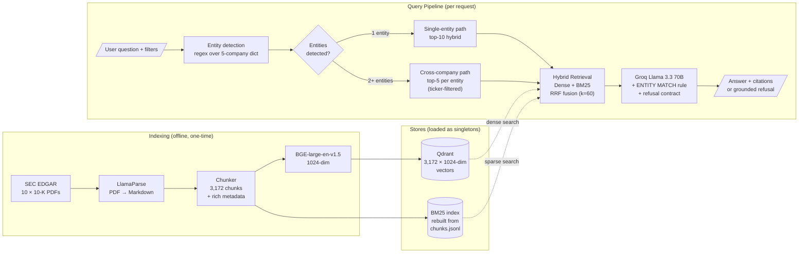

```mermaid
flowchart LR
    subgraph offline["Indexing (offline, one-time)"]
        direction TB
        E["SEC EDGAR<br/>10 × 10-K PDFs"]
        LP["LlamaParse<br/>PDF → Markdown"]
        CH["Chunker<br/>3,172 chunks<br/>+ rich metadata"]
        BGE["BGE-large-en-v1.5<br/>1024-dim"]
        E --> LP --> CH --> BGE
    end

    subgraph stores["Stores (loaded as singletons)"]
        direction TB
        Q[("Qdrant<br/>3,172 × 1024-dim<br/>vectors")]
        B[("BM25 index<br/>rebuilt from<br/>chunks.jsonl")]
    end

    BGE --> Q
    CH --> B

    subgraph runtime["Query Pipeline (per request)"]
        direction TB
        U[/"User question + filters"/]
        ED["Entity detection<br/>regex over 5-company dict"]
        R{"Entities<br/>detected?"}
        SE["Single-entity path<br/>top-10 hybrid"]
        CC["Cross-company path<br/>top-5 per entity<br/>(ticker-filtered)"]
        HR["Hybrid Retrieval<br/>Dense + BM25<br/>RRF fusion (k=60)"]
        G["Groq Llama 3.3 70B<br/>+ ENTITY MATCH rule<br/>+ refusal contract"]
        OUT[/"Answer + citations<br/>or grounded refusal"/]

        U --> ED --> R
        R -- "1 entity" --> SE --> HR
        R -- "2+ entities" --> CC --> HR
        HR --> G --> OUT
    end

    Q -.->|dense search| HR
    B -.->|sparse search| HR
```